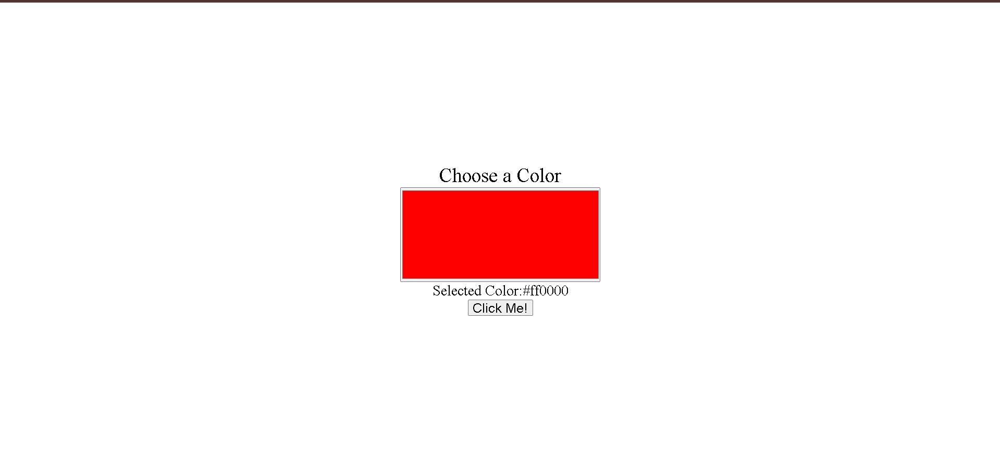

# DynamicColorPicker  
An interactive color picker built using HTML, CSS, and JavaScript. Easily pick, preview, and copy color codes for your design projects.  

## Features  
- User-friendly interface  
- Real-time color selection  
- Displays both HEX and RGB color values  
- Copy color codes with one click  

## Demo Screenshot  
  

## How It Works  
1. Move the color sliders or input a color value.  
2. The background updates instantly to the selected color.  
3. Copy the color code by clicking the provided button.  

## Technologies Used  
- **HTML5**: For structuring the page  
- **CSS3**: For styling the UI  
- **JavaScript**: For interactivity and logic  

## Installation and Usage  
1. Clone this repository:  
   git clone https://github.com/CodeByAlok/DynamicColorPicker.git

